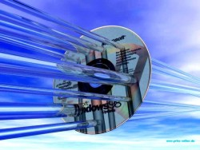

#  [98](https://98.js.org)

A web based Windows 98 desktop remake.

Includes:
*  Notepad
*  Sound Recorder
*  Paint ([separate repo](https://github.com/1j01/jspaint))
* [ Minesweeper](https://github.com/ziebelje/minesweeper) by [Jon Ziebell](https://github.com/ziebelje/)

## Try it out

[ ＥＮＴＥＲ　　ＷＩＮＤＯＷＳ　９８　体験へようこそ](https://98.js.org/)

## Related Projects

* [Pipes](https://github.com/1j01/pipes) (not yet integrated)
* [Winamp2-js](https://github.com/captbaritone/winamp2-js) (not yet integrated)
* [rahul.io](https://rahul.io/), another Windows 98 remake
* [Windows 93](https://www.windows93.net/), which is... something. definitely something.

## Contributing

See [CONTRIBUTING](CONTRIBUTING.md)

## TODO

See [TODO](TODO.md)
