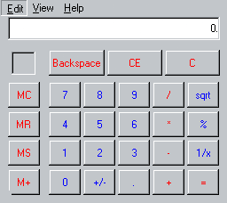
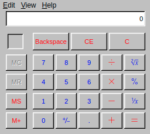

#  Calculator

Remake of the Windows 98 Calculator program for the web, using the [open sourced Windows 10 calculator](https://github.com/microsoft/calculator) engine, [ported to the web](https://github.com/muzam1l/mcalculator) by [muzamil](https://github.com/muzam1l).
Interface recreated in detail by [Isaiah Odhner](https://isaiahodhner.io).

Try it [as part of 98](https://98.js.org/) or [standalone](https://98.js.org/programs/calculator/)

<table>
<tr><td>Reference</td><td>Remake</td></tr>
<tr>
<td></td>
<td></td>
</tr>
</table>

Differences from the original Calculator app in Windows 98:
1. It uses the math symbol font from the Windows 10 calculator app, instead of text like "sqrt". Minus and decimal point are easily distinguishable.
2. MC and MR buttons are disabled when nothing is stored in memory
3. Decimal point is not shown until you add one
4. Scientific mode not supported yet

## TODO
<!-- 
improvements to port upstream:
- fixed subtract key typo and thus handling
- fixed lots of spelling
- click history and memory items to re-enter that input
- copy and paste
- prevent triggering focused button at the same time as Equals function when pressing Enter
- prevent opening Quick Find in Firefox when pressing slash
- handle M+ pressed before MS
- fixed bug where MS after MC wouldn't show memory stored, until you press it N times, where N increases if you repeat this
- more keyboard inputs supported
-->

Bugs:
- Is there a race condition where script.js loads too late to define `initialise` for `engine.js` to call? or is order guaranteed even with `async` somehow? is `async` really helping in some way?
- `.memory-item .btns > *` aren't `button`s (and nesting buttons is a bad UI pattern, and nesting (real) `button`s doesn't work in HTML)
- There's a layout bug where the Backspace/CE/C buttons can be the wrong size and then they snap back to the right size when clicking or trying to inspect the elements. I think it only happens when changing the CSS with live-server though, so probably not a problem in production.

Todo:
- Display errors
- Scientific mode
- Right click -> What's this?
- woff in addition to ttf (could steal from uno or convert from ttf), or remove font and use shitty ASCII representation..?
- Improve Copy/Paste function availability using older clipboard access APIs? Like handle paste event? (keyboard only)
- Increase limit of digits you can enter, as it was longer in old Windows
- When pasting, handle operators, not just numbers and special colon commands
