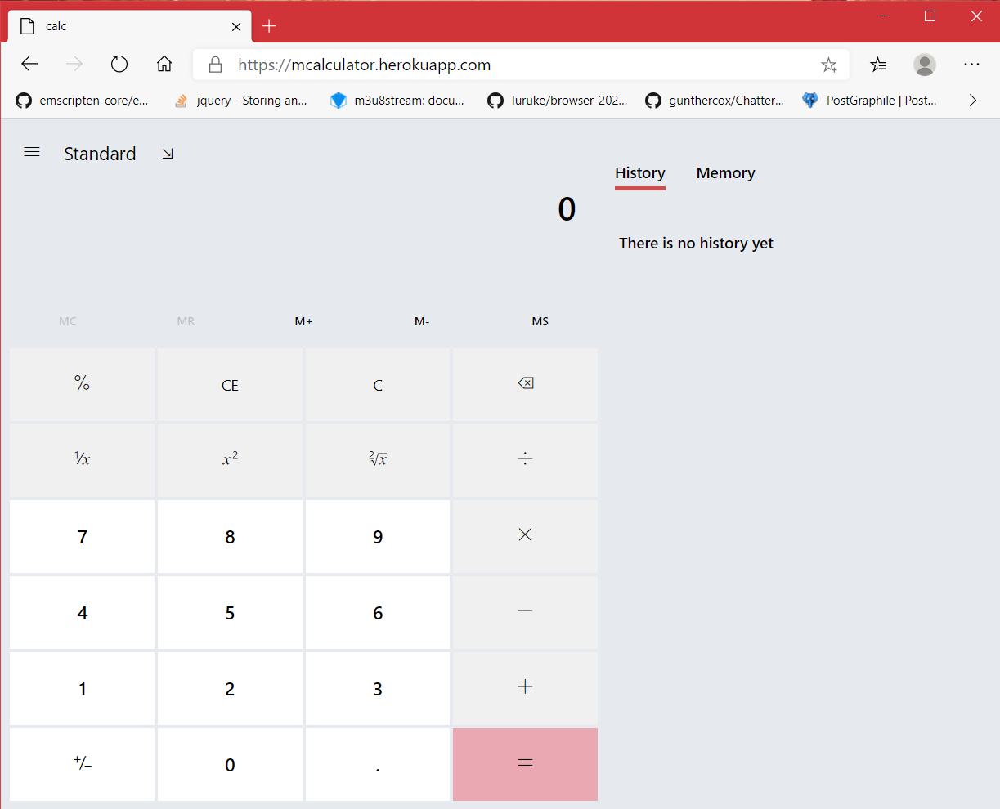
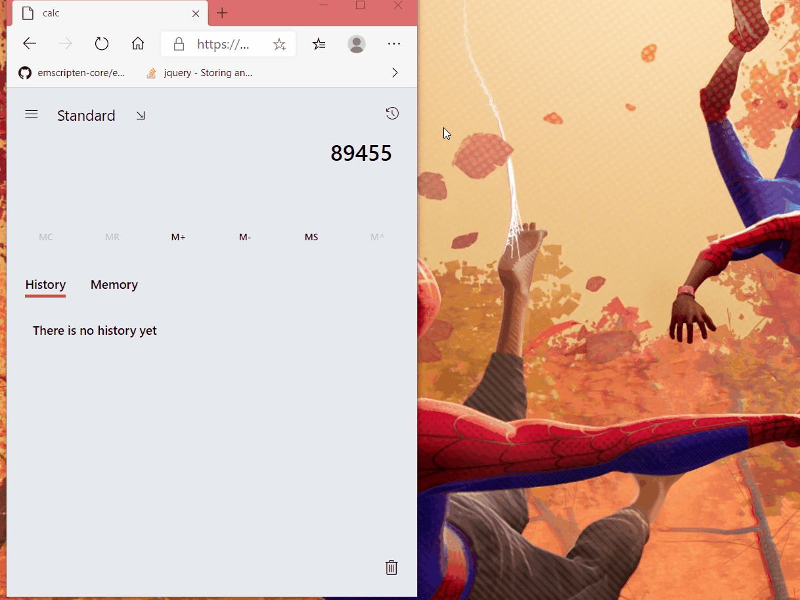
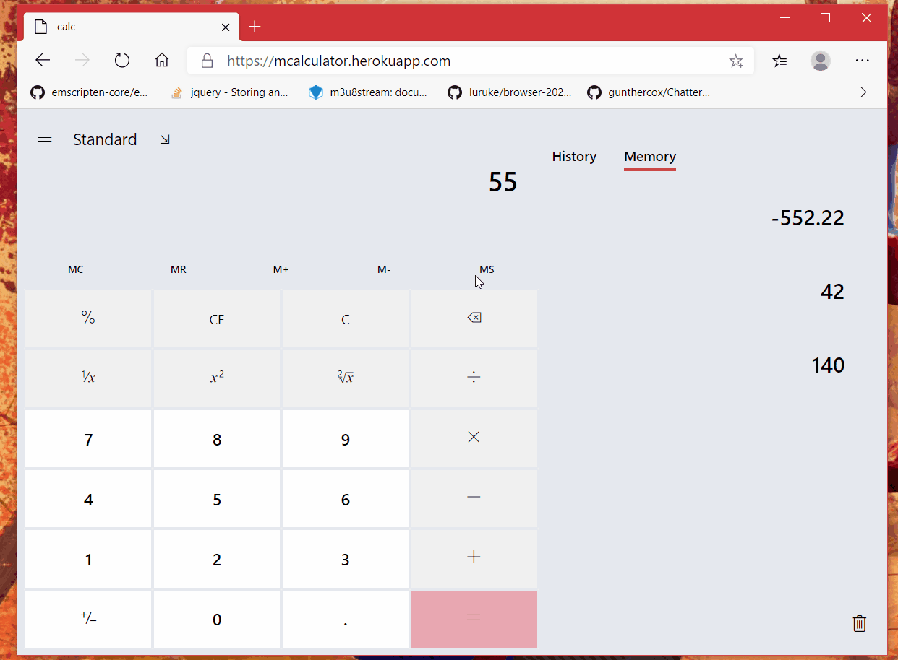

# mcalculator

It is a web port of Microsoft Calculator App engine, emulating the same UI on frontend. 

This project exists to test the scope of porting Desktop utilities, written in native code, to Web so as to run everywhere #WebIsTheFuture.

Try it here
https://muzam1l.github.io/mcalculator/ (new link)(faster)

https://mcalculator.herokuapp.com/ (old link)(slower)(still maintained)

# Core
Engine is written entirely in cpp with modern cpp17 and legacy code mixed with windows specific tools. However modifying it to make it work with other tools like gcc or clang   was not so difficult thanks to efforts in last year by contributors of calculator on github. After adding my thin cpp View layer to interact with it, i compiled the [engine](./engine) to WebAssembly using [Emscripten](https://emscripten.org/) (which behaves like clang), adding my hooks here and there to make it interact with javascript in browser environment. So i was successful in getting engine.wasm to run locally in browser.

# UI
UI layer was written in plain HTML, CSS, and vanilla Javascript to make it and whole app tiny sized to load and run fast. All the front-end tasks, like capturing Keyboard and button clicks and mapping these to commands to be sent to engine are maintained at this layer. This layer then sends these commands to engine which does all the calculation and most of the error and state handling.

UI is very responsive and fluent and loads super fast even on slower connections and low-end mobile devices. Once loaded for first time, subsequent loads are even faster thanks to caching of of files like wasm assets. 

App now can be installed like native app and is available offline, thanks to @NWylynko. On mobile devices use "Add to homescreen" and on desktop use plus icon in address bar to install (new link).

# Current development
As of now only Standard mode is available in this build 😜(#reduces to more of a POC 😊). But i am working on Scientific Mode which will be pushed in few days 🤗. Offline mode and Native app is also soon. Further development is subjected to interests and contributions of you guys (whoever reads this or just for myself 🥴😭)

# Features working as of now
* [infinite precision](https://en.wikipedia.org/wiki/Arbitrary-precision_arithmetic) (#as it is engine feature).
* Whole Standard Mode (#i know this isn't much, so using 'whole' to exaggerate) to meet basic calculator requirements.
* History panel, with NO copy paste as of now (#on both web and phones 🤔).
* Memory list panel, WITH individual memory item change (MC, M+, M- on each list item, hover or tap list to show these buttons)

# Contributing
There ain't even any tests, so make it or break it, i just need your contri (and again, if i am only one reading, contri on me only 😣)

# Build 🤷‍♂️
You'll need Emscripten to build. 
1. [Download and install](https://emscripten.org/docs/getting_started/downloads.html#sdk-download-and-install) emscripten.

Then you may have emscripten installed on some path say /path/to/emscripten (for example my path to emcc looks like this `/home/muzam/bin/emsdk/upstream/emscripten/emcc` )

2. Then cd to engine/ (or copy engine/ to different location to play around) and enter following in terminal

    `</path/to/emscripten>/emcmake cmake .`

    `</path/to/emscripten>/emmake make`

    `</path/to/emscripten>/emcc -02 libEngine.a CalcManager/libCalcManager.a CalcModel/libCalcModel.a  -o engine.js`

First two lines generates cmake files and lib.a files respectively in their respective folders.
All this behavior is controlled in respective CmakeFiles.txt

Third one generates engine.js and engine.wasm in project root (-o flag), These files can be copied directly and pasted in public/js of server (which is not automated yet 😬)

# Reporting Issues
if you are not using this on daily basis, dont report anything, contribute instead 😪.

And ...  nothing i am just ........  🤐.
